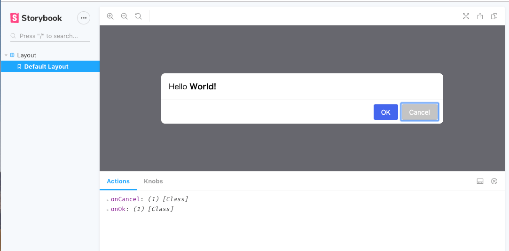

# react-async-dialog

Yes, you can do `await dialog.alert(<YourComponent />)` out of the box!

```
npm install react-async-dialog
```

```
yarn add react-async-dialog
```



### Why?

[React](https://github.com/facebook/react) provides a first-class way to use [Portals](https://reactjs.org/docs/portals.html), which makes modals easy to create.

But sometimes, you want a modal window that interferes your event handlers.

```jsx
if (
  await dialog.confirm(
    <>
      Are you <strong>REALLY</strong> sure?
    </>
  )
) {
  console.log("Ok, you are so sure!")
}
```

This library gives you this behavior out of the box!

### How to use

```jsx
import { DialogProvider, useDialog } from "react-async-dialog"

function YourApp({ save }) {
  const dialog = useDialog()

  const onSave = async e => {
    e.preventDefault()

    const ok = await dialog.confirm(<strong>Are you sure???</strong>, {
      ok: "YES!!!"
    })
    if (!ok) {
      return
    }

    save()
  }

  return <button onClick={onSave}>SAVE ME</button>
}

ReactDOM.render(
  <DialogProvider>
    <YourApp save={api.save} />
  </DialogProvider>,
  root
)
```

### Polyfills

`react-async-dialog` requires `Promise`.
